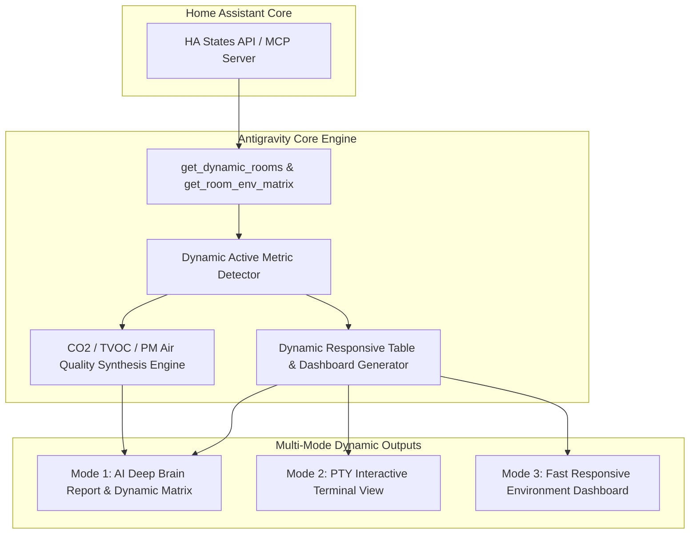

# 01. Add-on & Integration Interface & Sensor Architecture Specification

## 1. 개요 및 배경

Home Assistant 커스텀 통합구성요소(`antigravity_cli`)와 애드온(`antigravity-cli`) 간의 통신 아키텍처, 그리고 실내 다차원 환경 지표(온도, 습도, CO2, TVOC, PM2.5, PM10, 조도, 기압)를 방별로 동적 탐색하여 반응형 뷰(모드 1, 모드 3) 및 실시간 AI 맞춤 조언을 제공하기 위한 아키텍처 및 센서 데이터 모델 명세를 정의합니다.

---

## 2. 원인 분석 (Root Cause & Problem Statement)

### 2.1 기존 센서 탐색 구조의 한계
- **지표 하드코딩**: 기존 `core/sensors.py`의 `get_room_env_summary` 함수는 오직 `temperature`와 `humidity` 2개 지표만 필터링하여 수집하도록 고정되어 있음.
- **다차원 공기질 센서 무시**: 현대 스마트홈에 널리 보급된 이산화탄소(CO2), 휘발성 유기화합물(TVOC), 초미세먼지(PM2.5), 미세먼지(PM10), 조도(Illuminance), 기압(Atmospheric Pressure) 등 HA 표준 `device_class` 센서들이 존재하더라도 이를 식별하거나 방별 매핑 데이터로 집계하지 못함.

### 2.2 렌더러 테이블 구조의 정적 제약
- **고정된 마크다운 테이블 헤더**: `core/renderers.py`의 모드 1(AI 딥 브레인) 및 모드 3(환경 대시보드) 렌더러가 `| 구역 | 실내 온도 | 실내 습도 |` 형태의 고정된 열(Column) 구조만 출력.
- **동적 열 미지원**: 특정 방에 CO2 센서나 공기질 측정기가 있더라도 표에 반영되지 않으며, 반대로 센서가 전혀 없는 지표를 무조건 열로 넣을 경우 테이블 가독성이 저하되는 문제 발생.

### 2.3 AI 맞춤 권고(Recommendations)의 한계
- **단순 온습도 기반 추론**: `generate_dynamic_ai_recommendations` 함수가 외부/내부 온습도 차이 및 팬/조명 가동 여부만으로 환기 권고를 생성함.
- **실내 밀폐 및 공기질 위험 미인지**: 창문이 닫힌 상태에서 CO2 농도가 1500ppm 이상으로 치솟거나 TVOC가 급증하는 치명적인 실내 공기질 악화 상황을 감지하지 못하고 적절한 환기/환풍기 가동 조언을 내놓지 못함.

---

## 3. 아키텍처 수정 명세 (Architecture Specification)



### 3.1 Home Assistant 표준 환경 센서 모델링 규격

각 지표별 HA 표준 `device_class`, 단위(`unit_of_measurement`), 엔티티 식별 패턴 및 임계치 기준을 다음과 같이 정의합니다.

| 지표 코드 | 지표명 (UI 표시) | HA `device_class` | 표준 단위 | 엔티티/속성 매칭 패턴 | 이상/환기 주의 기준 |
| :--- | :--- | :--- | :--- | :--- | :--- |
| `temperature` | 온도 | `temperature` | `°C`, `°F` | `*_temperature`, `온도` | `< 18°C` (저온), `> 28°C` (과열) |
| `humidity` | 습도 | `humidity` | `%` | `*_humidity`, `습도` | `< 40%` (건조), `> 65%` (다습) |
| `co2` | CO2 | `carbon_dioxide` | `ppm` | `*_co2`, `*_carbon_dioxide`, `이산화탄소` | `> 1000 ppm` (주의), `> 1500 ppm` (경고) |
| `tvoc` | TVOC | `volatile_organic_compounds` | `µg/m³`, `ppb`, `mg/m³` | `*_tvoc`, `*_voc`, `유기화합물` | `> 250 µg/m³` (주의), `> 660 µg/m³` (경고) |
| `pm25` | PM2.5 | `pm25` | `µg/m³` | `*_pm25`, `*_pm2_5`, `초미세먼지` | `> 35 µg/m³` (나쁨), `> 75 µg/m³` (매우나쁨) |
| `pm10` | PM10 | `pm10` | `µg/m³` | `*_pm10`, `미세먼지` | `> 80 µg/m³` (나쁨), `> 150 µg/m³` (매우나쁨) |
| `illuminance` | 조도 | `illuminance` | `lx`, `lux` | `*_illuminance`, `*_lux`, `조도`, `밝기` | `< 50 lx` (어두움), `> 500 lx` (충분) |
| `pressure` | 기압 | `atmospheric_pressure`, `pressure` | `hPa`, `mbar` | `*_pressure`, `기압` | 급격한 기압 하강 (기상 악화) |

#### 제외 키워드 필터 (노이즈 방지)
- `배터리`, `battery`, `전압`, `voltage`, `cpu`, `최고`, `최저`, `지수`, `임계`, `threshold`, `soil`, `calibration`, `보정`, `power`, `energy` 등 환경 측정과 무관한 센서 배제.

---

### 3.2 방별 다차원 센서 동적 탐색 알고리즘 (`get_room_env_matrix`)

1. **공간(Room) 목록 추출**: `get_dynamic_rooms(states)`를 통해 사용자 설정 구역 및 명칭 목록 획득.
2. **센서 매핑 파이프라인**:
   - `states`를 순회하며 각 센서의 `device_class`, `unit_of_measurement`, `friendly_name`, `entity_id`를 분석.
   - 각 센서가 속한 공간(`room`)을 판별하고 지표 분류(`temperature`, `humidity`, `co2`, `tvoc`, `pm25`, `pm10`, `illuminance`, `pressure`)에 맞게 매핑.
3. **유효 지표(Active Metrics) 자동 감지**:
   - 전체 공간 중 1개 이상의 방에서 실제로 수집된 지표 목록(`active_metrics`)을 동적으로 산출.
   - 예: CO2 센서와 조도 센서가 있는 환경에서는 `[temperature, humidity, co2, illuminance]`가 활성화되어 테이블 열로 동적 렌더링됨.

---

### 3.3 반응형 렌더러 동적 테이블 규격

#### (1) Mode 1: AI 딥 브레인 환경 분석 (`get_ai_deep_environment_analysis`)
- **동적 헤더 구성**:
  `| 구역 (Zone) | 온도 | 습도 | [활성 지표 1] | [활성 지표 2] ... | 종합 환경 진단 |`
- **동적 평가(진단)**:
  - 온도/습도뿐만 아니라 CO2, TVOC, 미세먼지 수치를 종합 평가하여 `🟢 쾌적`, `🟡 환기 필요(CO2/VOC)`, `🟠 공기질 주의`, `🔴 즉시 환기 요망` 등 복합 상태 출력.

#### (2) Mode 3: 실시간 환경 대시보드 (`get_weather_env_summary`)
- **데스크톱 뷰**: 동적으로 활성화된 지표 열을 포함하는 고해상도 마크다운 테이블.
- **모바일 뷰 (반응형)**: 카드형 리스트로 지표를 컴팩트하게 배치.
  - 예: `• **거실**: 24.5°C / 52% | 🍃 CO2 650ppm | 💡 320 lx`

#### (3) Mode 2: PTY 터미널 뷰 (`get_terminal_cli_environment_view`)
- CLI 모니터 박스 테이블 내 동적 열 또는 핵심 공기질 지표(CO2, TVOC) 포맷 지원.

---

### 3.4 CO2 및 TVOC 농도 기반 실시간 AI 맞춤 조언 엔진 (`generate_dynamic_ai_recommendations`)

실시간 측정값에 따라 지능형 조언을 합성하는 규칙 엔진:

1. **CO2 농도 기반 실시간 환기/집중력 조언**:
   - **`CO2 >= 1500 ppm`**:
     > 🚨 **실내 이산화탄소 경고**: 현재 {room}({val} ppm)의 CO2 농도가 매우 높습니다. 두통 및 집중력 저하가 발생할 수 있으므로 **즉시 창문을 열고 환풍기/전열교환기를 최대 풍량으로 가동**하세요.
   - **`1000 ppm <= CO2 < 1500 ppm`**:
     > ⚠️ **공기 환기 권장**: {room}의 CO2 농도가 {val} ppm으로 높아지고 있습니다. 10~15분간 자연 환기를 진행하거나 환기 장치를 켜는 것을 권장합니다.
   - **`CO2 < 800 ppm`**:
     > 🍃 **청정 실내 공기**: 실내 CO2 농도({val} ppm)가 쾌적 수준으로 유지되어 학습 및 휴식에 적합합니다.

2. **TVOC 농도 기반 화학물질/유해가스 조언**:
   - **`TVOC >= 660 µg/m³` (또는 `> 220 ppb`)**:
     > ⚠️ **휘발성 유기화합물(TVOC) 주의**: {room}의 TVOC 농도({val})가 기준치를 초과했습니다. 조리 연기나 화학제품 사용 여부를 확인하고 **주방 후드 및 환풍기를 가동**하세요.

3. **초미세먼지(PM2.5) & 실외 기상 융합 조언**:
   - 실외 미세먼지가 나쁜 경우: 자연 환기 대신 **공기청정기 가동 및 내부 순환 모드** 권장.
   - 실내 PM2.5가 높고 실외가 깨끗한 경우: **적극적인 맞벌이 환기** 권장.

---

## 4. 구체적인 조치 예정 내역 (Action Plan)

| 순번 | 대상 파일 | 주요 작업 내용 |
| :---: | :--- | :--- |
| **Task 1** | `addons/antigravity-cli/core/sensors.py` | - 표준 지표 정의 맵(`ENV_METRICS`) 구축<br>- 다차원 환경 센서 매트릭스 추출 함수 `get_room_env_matrix(states)` 구현<br>- CO2, TVOC, PM2.5, PM10, 조도, 기압 파싱 로직 추가 |
| **Task 2** | `addons/antigravity-cli/core/renderers.py` | - `generate_dynamic_ai_recommendations`에 CO2, TVOC, 미세먼지 기반 정밀 진단 로직 추가<br>- `get_ai_deep_environment_analysis` 동적 컬럼 마크다운 테이블 생성<br>- `get_weather_env_summary` 동적 컬럼 및 모바일 반응형 뷰 개선<br>- `get_terminal_cli_environment_view` 터미널 뷰 갱신 |
| **Task 3** | `addons/antigravity-cli/core/ha_engine.py` | - 공기질, CO2, TVOC, 미세먼지, 조도, 기압 자연어 인텐트 쿼리 패턴 등록<br>- 방별 공기질 조회 질의 대응 로직 연결 |
| **Task 4** | 검증 및 보고 | - 가상 센서 데이터 및 실제 HA 환경 기반 출력 마크다운 렌더링 검증<br>- QA 테스트 및 최종 보고서 작성 |

---

## 5. 기존 REST API 인터페이스 계약 (Contract)

### 5.1 포트 및 프로토콜
- **프로토콜**: HTTP/1.1 REST API
- **기본 포트**: `8000/tcp` (호스트 매핑 8000)
- **인증 방식**: `Authorization: Bearer <API_KEY>` (설정 시)

### 5.2 엔드포인트 규격
1. `GET /api/status`
   - **설명**: 통합구성요소 `AntigravityDataUpdateCoordinator`의 상태 폴링 엔드포인트
   - **응답 코드**: `200 OK` (정상), `401 Unauthorized` (인증 실패)
   - **응답 JSON 스키마**:
     ```json
     {
       "status": "online",
       "version": "1.3.0",
       "active_sessions": 1,
       "uptime": 120
     }
     ```
2. `POST /api/chat` (어시스턴트 파이프라인 / Conversation)
   - **설명**: Home Assistant Assist에서 사용자의 텍스트/음성 프롬프트를 전달받아 에이전트 응답을 반환
   - **요청 Body**: `{"prompt": "...", "conversation_id": "...", "language": "ko", "stream_mode": 1}`
   - **응답 JSON**: `{"response": "...", "conversation_id": "..."}`
3. `GET /api/chat/stream` (SSE 실시간 스트리밍)
   - **설명**: 모드 1(AI 분석), 모드 2(PTY 터미널), 모드 3(대시보드) 실시간 스트리밍 SSE 엔드포인트
   - **요청 파라미터**: `?prompt=...&mode=1`
   - **응답 형식**: `text/event-stream`
