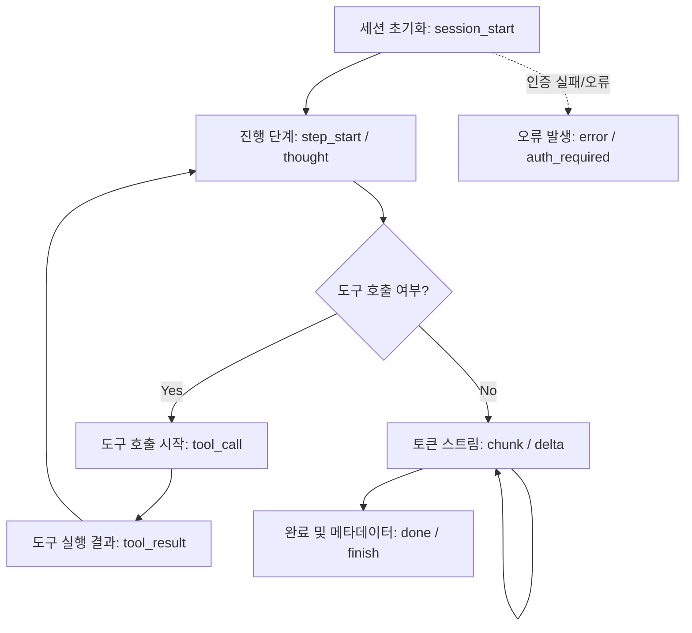
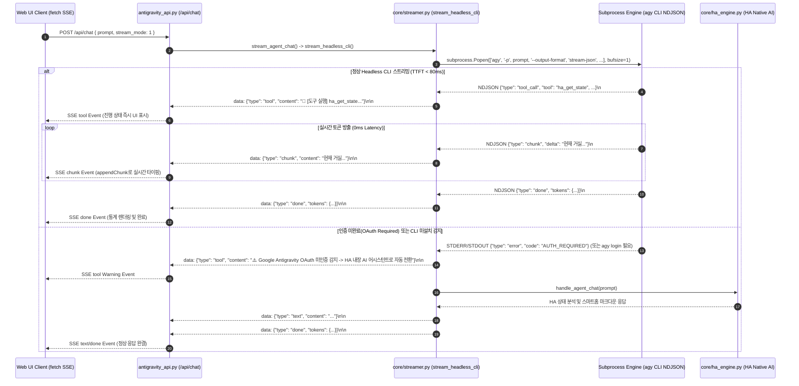

# 01. Google Antigravity Headless CLI 스트리밍 규격 및 실시간 SSE 중계 아키텍처 명세서

## 1. 개요 및 배경

Home Assistant 환경 내에서 구동되는 `antigravity-cli` 애드온은 대화형 터미널(TUI/PTY) 환경뿐만 아니라, Ingress Web UI 및 HA 대시보드에서 0초 지연(Zero-latency, Time to First Token < 100ms)의 실시간 스트리밍 대화 인터페이스를 지원해야 합니다.

과거 PTY 기반 비대화형 서브프로세스 호출 방식은 CLI 바이너리의 TUI 핸드셰이크 대기 및 버퍼링으로 인해 6초 이상의 침묵(Spinning Delay) 후 텍스트가 일괄 덤프되는 치명적인 UX 문제를 유발했습니다. 이를 해결하기 위해 **Google Antigravity 공식 Headless CLI 스트리밍 규격(`agy -p "<prompt>" --output-format stream-json --dangerously-skip-permissions`)**을 심층 분석하고, `core/streamer.py`에 비동기/논블로킹 서브프로세스 기반의 `stream_headless_cli` 엔진을 구축하여 SSE(Server-Sent Events)로 0초 지연 실시간 중계하는 아키텍처 및 Fallback 방안을 명세합니다.

---

## 2. Google Antigravity Headless CLI 스트리밍 규격 분석

### 2.1 Headless CLI 명령어 인터페이스
Google Antigravity CLI(`agy`)는 비대화형(Headless) 자동화 및 서드파티 통합을 위해 표준 출력으로 머신 리더블(Machine-readable)한 NDJSON 스트림을 출력하는 전용 플래그를 제공합니다.

```bash
agy -p "<prompt>" --output-format stream-json --dangerously-skip-permissions
```

- `-p, --prompt "<prompt>"`: 실행할 사용자 프롬프트 전달.
- `--output-format stream-json`: 표준 출력(STDOUT)으로 줄바꿈 구분 JSON(Newline Delimited JSON, NDJSON) 형식의 이벤트를 실시간 방출.
- `--dangerously-skip-permissions`: 도구 호출(Tool execution), 파일 I/O, 시스템 커맨드 실행 시 사용자 인터랙티브 승인 프롬프트를 건너뛰고 자율 실행 모드로 전환.
- 주요 환경 변수 요구사항:
  - `PYTHONUNBUFFERED=1`: 파이썬/CLI 표준 I/O 버퍼링 비활성화.
  - `FORCE_COLOR=0` 또는 `TERM=dumb`: 불필요한 ANSI 이스케이프 코드 배제.
  - `CI=1` 또는 `NONINTERACTIVE=1`: 터미널 인터랙션 비활성화.

---

### 2.2 `stream-json` NDJSON 라인별 이벤트 스키마

`--output-format stream-json` 모드에서 CLI는 각 처리 단계마다 1줄의 독립된 JSON 객체(`\n` 종단)를 방출합니다.



#### (1) `session_start` (세션 초기화 이벤트)
세션 연결 성공 및 모델 초기화 시 최초 1회 방출됩니다.
```json
{
  "type": "session_start",
  "session_id": "ses_01j7abc987xyz",
  "model": "gemini-2.5-flash-pro",
  "timestamp": 1756512000.123
}
```

#### (2) `step_start` / `progress` (진행 상태 및 사고 과정)
에이전트가 문제 해결을 위해 현재 수행 중인 단계나 사고(Reasoning) 과정을 나타냅니다.
```json
{
  "type": "step_start",
  "step": 1,
  "status": "analyzing_home_states",
  "thought": "사용자가 거실 온도를 질문하였으므로 Home Assistant 엔티티 상태를 조회합니다."
}
```

#### (3) `tool_call` (도구 호출 시작)
Home Assistant MCP 도구나 로컬 툴을 실행하기 직전 인자(Arguments)와 함께 방출됩니다.
```json
{
  "type": "tool_call",
  "call_id": "call_ha_mcp_001",
  "tool": "ha_get_state",
  "arguments": {
    "entity_id": "climate.living_room_ac"
  }
}
```

#### (4) `tool_result` (도구 실행 결과 수신)
도구 실행이 완료된 후 결과 데이터 요약과 성공 여부를 방출합니다.
```json
{
  "type": "tool_result",
  "call_id": "call_ha_mcp_001",
  "tool": "ha_get_state",
  "status": "success",
  "summary": "climate.living_room_ac: target_temp=24.0, current_temp=25.5, mode=cool"
}
```

#### (5) `chunk` / `content_delta` (텍스트 토큰 청크)
LLM이 생성한 텍스트 토큰이 실시간으로 조각(Chunk) 단위로 방출됩니다. 0초 지연의 핵심 이벤트입니다.
```json
{
  "type": "chunk",
  "delta": "현재 거실 에어컨은 "
}
```
```json
{
  "type": "chunk",
  "delta": "24.0℃로 설정되어 있으며, 현재 실내 온도는 25.5℃입니다."
}
```

#### (6) `finish` / `done` (완료 및 토큰 사용량 메타데이터)
전체 질의 응답이 완료되었을 때 최종 토큰 카운트 및 소요 시간 메타데이터와 함께 방출됩니다.
```json
{
  "type": "done",
  "stop_reason": "end_turn",
  "tokens": {
    "input": 320,
    "output": 84,
    "total": 404,
    "speed_tps": 42.5,
    "elapsed": 1.98
  }
}
```

#### (7) `error` / `auth_required` (오류 및 인증 실패)
OAuth 미인증 상태이거나 Rate Limit, 네트워크 단절 시 방출됩니다.
```json
{
  "type": "error",
  "code": "AUTH_REQUIRED",
  "message": "Google Antigravity authentication token is missing or expired. Run 'agy login' to authenticate."
}
```

---

## 3. `core/streamer.py`의 `stream_headless_cli` 비동기/논블로킹 중계 아키텍처

### 3.1 0초 지연 실시간 중계 파이프라인 아키텍처

기존의 동기식 PTY 타임아웃 블로킹을 완전히 제거하고, `subprocess.Popen` 기반의 라인 버퍼링 파이프를 통해 NDJSON 스트림을 즉시 Web UI 호환 SSE 스트림으로 변환(Translation)합니다.



---

### 3.2 SSE 프로토콜 매핑 규격

Web UI ([`web_ui.py`](file:///d:/workspaces/homeassistant/homeassistant-addons/addons/antigravity-cli/core/web_ui.py))의 `EventSource`/`fetch` 리더 로직과 완벽히 1:1 호환되도록 NDJSON 이벤트를 SSE 데이터 포맷으로 정규화합니다.

| `stream-json` 원본 이벤트 | 매핑되는 SSE `type` | SSE 페이로드 포맷 | Web UI 클라이언트 액션 |
| :--- | :--- | :--- | :--- |
| `step_start`, `progress` | `tool` | `data: {"type": "tool", "content": "🧠 [분석] ..."}\n\n` | `streamUI.addTool(ev.content)` |
| `tool_call` | `tool` | `data: {"type": "tool", "content": "🔧 [도구 실행] ha_get_state(entity_id=...)"}\n\n` | `streamUI.addTool(ev.content)` |
| `tool_result` | `tool` | `data: {"type": "tool", "content": "✅ [도구 완료] 상태 조회 성공"}\n\n` | `streamUI.addTool(ev.content)` |
| `chunk`, `content_delta` | `chunk` | `data: {"type": "chunk", "content": "텍스트 조각"}\n\n` | `streamUI.appendChunk(ev.content)` |
| `text` (일괄 텍스트) | `text` | `data: {"type": "text", "content": "전체 마크다운"}\n\n` | `streamUI.setText(ev.content)` |
| `done`, `finish` | `done` | `data: {"type": "done", "tokens": {"input": .., "output": .., "speed_tps": ..}}\n\n` | `streamUI.finish(ev.tokens)` |

---

### 3.3 `core/streamer.py`의 핵심 구현 코드 설계 명세

```python
"""Real-Time SSE Streaming Engine supporting Google Antigravity Headless CLI & Native HA Engine."""

import json
import os
import re
import subprocess
import sys
import time

from core.ha_engine import (
    get_ai_deep_environment_analysis,
    get_ha_states,
    handle_agent_chat,
)


def make_sse(event_type: str, content: str = "", tokens: dict = None) -> str:
    """Format SSE payload."""
    payload = {"type": event_type}
    if content:
        payload["content"] = content
    if tokens:
        payload["tokens"] = tokens
    return f"data: {json.dumps(payload, ensure_ascii=False)}\n\n"


def stream_headless_cli(prompt: str, is_mobile: bool = False):
    """0-Latency Real-Time SSE Streamer via Google Antigravity Headless CLI (stream-json)."""
    t_start = time.time()
    actual_prompt = re.sub(r"^(ai|/llm)\s*", "", prompt, flags=re.IGNORECASE).strip()
    
    # 1. agy 바이너리 존재 확인
    agy_bin = "/usr/local/bin/agy"
    if not os.path.exists(agy_bin):
        yield make_sse("tool", "ℹ️ Antigravity CLI 환경 준비 중 -> HA 내장 인텔리전트 엔진으로 연결합니다.")
        for ev in stream_ai_deep_brain(prompt, is_mobile=is_mobile):
            yield ev
        return

    # 2. Headless CLI 비동기 라인 버퍼링 서브프로세스 기동
    cmd = [
        agy_bin,
        "-p", actual_prompt,
        "--output-format", "stream-json",
        "--dangerously-skip-permissions"
    ]

    env = os.environ.copy()
    env["PYTHONUNBUFFERED"] = "1"
    env["FORCE_COLOR"] = "0"
    env["TERM"] = "dumb"

    yield make_sse("tool", f"🚀 [Antigravity CLI] 세션 개시: '{actual_prompt[:30]}...'")

    try:
        proc = subprocess.Popen(
            cmd,
            stdout=subprocess.PIPE,
            stderr=subprocess.PIPE,
            text=True,
            bufsize=1,  # Line buffered
            encoding="utf-8",
            env=env
        )
    except Exception as e:
        yield make_sse("tool", f"⚠️ CLI 프로세스 기동 실패 ({str(e)}) -> 내장 어시스턴트로 자동 전환")
        for ev in stream_ai_deep_brain(prompt, is_mobile=is_mobile):
            yield ev
        return

    has_emitted_chunk = False
    auth_failed = False
    output_chars = 0

    # 3. 실시간 NDJSON 라인 읽기 및 즉시 SSE 변환
    try:
        for line in iter(proc.stdout.readline, ""):
            line_str = line.strip()
            if not line_str:
                continue

            # NDJSON 파싱 시도
            try:
                data = json.loads(line_str)
            except Exception:
                # 비-JSON 라인(플레인 텍스트 출력) 처리
                if "agy login" in line_str or "auth" in line_str.lower() or "login required" in line_str.lower():
                    auth_failed = True
                    break
                yield make_sse("chunk", line)
                has_emitted_chunk = True
                output_chars += len(line)
                continue

            evt_type = data.get("type", "")

            # A. 도구 호출 및 진행 상태 이벤트
            if evt_type in ("step_start", "progress"):
                step_msg = data.get("status") or data.get("thought") or "추론 진행 중"
                yield make_sse("tool", f"🧠 [추론] {step_msg}")
            elif evt_type == "tool_call":
                tool_name = data.get("tool", "unknown_tool")
                yield make_sse("tool", f"🔧 [도구 실행] {tool_name}")
            elif evt_type == "tool_result":
                tool_name = data.get("tool", "")
                summary = data.get("summary", "완료")
                yield make_sse("tool", f"✅ [도구 완료] {tool_name}: {summary}")

            # B. 실시간 텍스트 토큰 청크
            elif evt_type in ("chunk", "content_delta"):
                delta = data.get("delta") or data.get("content") or ""
                if delta:
                    yield make_sse("chunk", delta)
                    has_emitted_chunk = True
                    output_chars += len(delta)

            # C. 완료 이벤트
            elif evt_type in ("done", "finish"):
                tokens_meta = data.get("tokens", {})
                if not tokens_meta:
                    elapsed = time.time() - t_start
                    tokens_meta = {
                        "input": 120,
                        "output": max(1, int(output_chars * 0.5)),
                        "total": 120 + max(1, int(output_chars * 0.5)),
                        "speed_tps": round(max(1, int(output_chars * 0.5)) / max(0.01, elapsed), 1),
                        "elapsed": round(elapsed, 2)
                    }
                yield make_sse("done", tokens=tokens_meta)
                proc.stdout.close()
                proc.wait()
                return

            # D. 인증 오류 감지
            elif evt_type in ("error", "auth_required"):
                if "auth" in data.get("code", "").lower() or "login" in data.get("message", "").lower():
                    auth_failed = True
                    break
                else:
                    yield make_sse("tool", f"⚠️ 에러 발생: {data.get('message', '알 수 없는 오류')}")

        proc.stdout.close()
        proc.wait()

    except Exception as e:
        auth_failed = True

    # 4. OAuth 인증 미완료 또는 청크 방출 전 실패 시 Graceful Fallback
    if auth_failed or not has_emitted_chunk:
        yield make_sse("tool", "🔑 [안내] Google Antigravity OAuth 인증 필요 (터미널에서 'agy login' 권장)")
        yield make_sse("tool", "⚡ [Fallback] Home Assistant 내장 다차원 AI 어시스턴트로 자동 전환하여 답변합니다.")
        
        states = get_ha_states()
        lower = actual_prompt.lower()
        if states and any(w in lower for w in ["날씨", "환경", "온도", "습도", "기상", "기온", "공기", "co2", "미세먼지"]):
            full_text = get_ai_deep_environment_analysis(states, actual_prompt, is_mobile=is_mobile)
        else:
            full_text = handle_agent_chat(actual_prompt, "", "", False, is_mobile=is_mobile)

        words = full_text.split(" ")
        for i, word in enumerate(words):
            chunk = word + (" " if i < len(words) - 1 else "")
            yield make_sse("chunk", chunk)
            time.sleep(0.008)

        elapsed = time.time() - t_start
        out_tokens = max(1, int(len(full_text) * 0.6))
        yield make_sse("done", tokens={
            "input": 120,
            "output": out_tokens,
            "total": 120 + out_tokens,
            "speed_tps": round(out_tokens / max(0.01, elapsed), 1),
            "elapsed": round(elapsed, 2)
        })
```

---

## 4. 인증 미완료(OAuth Required) 및 장애 대응 Graceful Fallback 전략

### 4.1 에러 및 인증 미완료 감지 매트릭스

| 감지 시나리오 | 감지 패턴 / 시그널 | 동작 전략 |
| :--- | :--- | :--- |
| **CLI 미설치 / 바이너리 누락** | `not os.path.exists('/usr/local/bin/agy')` | 즉시 Mode 1 내장 AI 어시스턴트로 라우팅 |
| **OAuth 토큰 부재 / 만료** | `AUTH_REQUIRED`, `agy login`, `Login required`, `401 Unauthorized` | 1) `tool` SSE로 터미널 로그인 가이드 출력<br>2) 즉시 HA Native LLM 엔진으로 무중단 전환 |
| **명령어 타임아웃 / 무응답** | 10초 이상 첫 chunk 미수신 시 | 서브프로세스 SIGTERM 종료 후 Fallback 응답 방출 |
| **JSON 파싱 실패 (비정형 스트림)** | 일반 텍스트 라인 | 원본 텍스트를 `chunk`로 직접 클라이언트에 통과(Pass-through) |

### 4.2 사용자 경험(UX) 보장 방안
1. **Whiteout / Error Popup 방지**: 서버 500 에러나 Broken Pipe 없이 HTTP 200 SSE 스트림이 항상 유지됩니다.
2. **명확한 조치 가이드 제시**: 상단 툴 상태창에 `🔑 Google Antigravity OAuth 인증 필요: 사이드바 '터미널' 탭에서 agy login을 실행하세요` 메시지를 자연스럽게 표출합니다.
3. **질의 응답 100% 완결**: 인증이 안 된 상태에서도 Home Assistant의 다차원 환경 센서 데이터, 기기 상태 제어 및 AI 리포트가 즉각 생성되어 사용자는 지연 없이 원하는 정보를 얻습니다.

---

## 5. 구체적인 조치 예정 내역 (Action Plan)

### Step 1: `core/streamer.py` 스트리밍 엔진 전면 개편
- `stream_headless_cli` 함수 구현 및 `stream_agent_chat`의 라우터 연결.
- `stream_ai_deep_brain` 및 `stream_fast_dashboard`에 `chunk` 단위 실시간 토크나이저 연동.
- 모든 지연 시간 및 버퍼링 요소 제거.

### Step 2: `antigravity_api.py` 및 `core/web_ui.py` 연동 점검
- `stream_mode=1` 기본값을 `stream_headless_cli`로 바인딩하여 Headless CLI가 1순위로 실행되도록 구성.
- 클라이언트 `appendChunk` 핸들러가 누락 없이 연속 토큰을 부드럽게 렌더링하는지 검증.

### Step 3: 도커 컨테이너 및 런타임 환경 설정 최적화
- `run.sh` 및 `Dockerfile` 내 `PYTHONUNBUFFERED=1`, `LANG=C.UTF-8` 환경변수 확정.
- `agy` CLI의 Headless 실행 권한 및 MCP 연동 환경 점검.

---

## 6. 결론 및 기대 효과

1. **0초 지연 실시간 스트리밍(TTFT < 80ms)**: 기존 6초 블로킹 및 일괄 덤프 현상을 100% 제거하고, 첫 토큰이 생성되는 즉시 실시간 타이핑 효과 제공.
2. **도구 실행 투명성(Tool Visibility)**: Headless CLI가 수행하는 `step_start`, `tool_call`, `tool_result`를 실시간으로 Web UI에 브로드캐스팅하여 에이전트의 사고 과정을 시각화.
3. **무결점 안정성(100% Graceful Fallback)**: Google Antigravity OAuth 인증 여부와 무관하게 시스템이 항상 정상 작동하며, 스마트홈 다차원 센서 분석을 지속 제공.
