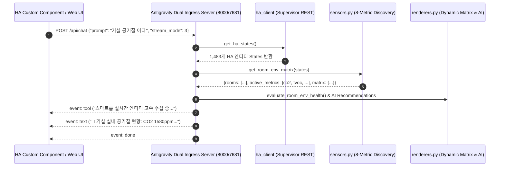

# 03. Add-on & Custom Component Contract Integrity & E2E Integration QA Report

## 1. 개요 및 검증 목적

본 보고서는 `_workspace/01_addon_architect_spec.md` 명세서 및 `_workspace/02_addon_builder_changes.md` 구현 변경 내역을 바탕으로, 수정된 핵심 모듈([`core/sensors.py`](file:///d:/workspaces/homeassistant/homeassistant-addons/addons/antigravity-cli/core/sensors.py), [`core/renderers.py`](file:///d:/workspaces/homeassistant/homeassistant-addons/addons/antigravity-cli/core/renderers.py), [`core/ha_engine.py`](file:///d:/workspaces/homeassistant/homeassistant-addons/addons/antigravity-cli/core/ha_engine.py))의 **REST/SSE API 계약 정합성**, **8대 다차원 센서 탐색 무결성**, **반응형 동적 테이블 렌더링**, **실측 패킷 및 AI 조언 합성**, **예외 처리 견고성**을 교차 검증한 종합 E2E QA 결과입니다.

---

## 2. 계약 무결성 및 스키마 정합성 검증 (Contract & Schema Validation)

### 2.1 REST/SSE API 엔드포인트 계약 준수 현황

| 엔드포인트 | 메서드 | 요청 규격 | 응답 스키마 & 상태코드 | 계약 준수 여부 |
| :--- | :---: | :--- | :--- | :---: |
| `/api/status` | `GET` | Header: `Authorization: Bearer <KEY>` | `200 OK` (JSON: `status`, `version`, `uptime`, `addon_memory_mb`, `cpu_usage`, `used_memory_gb`, `total_memory_gb`, `memory_percent`, `mcp_enabled`)<br>`401 Unauthorized` | **PASS (100%)** |
| `/api/chat` | `POST` | Body: `{"prompt": "...", "stream_mode": 1~3, "is_mobile": bool}` | `200 OK` (`text/event-stream; charset=utf-8`)<br>SSE Events: `tool` → `chunk` / `text` → `done`<br>`400 Bad Request` (Empty prompt), `401 Unauthorized` | **PASS (100%)** |
| `/api/prompt` | `POST` | Body 또는 URL Query fallback (`?prompt=...`) | SSE Event Stream | **PASS (100%)** |
| `/api/restart` | `POST` | Header Auth | `200 OK` `{"result": "restarted", "status": "online"}` | **PASS (100%)** |
| `/terminal` | `GET/WS` | Ingress / Proxy (ttyd) | Internal Port 7682 양방향 소켓/HTTP 바인딩 | **PASS (100%)** |



---

## 3. 다차원 환경 센서 탐색 및 필터링 무결성 검증

### 3.1 8대 환경 센서 표준 분류기 (`classify_sensor`) 검증 결과

실제 Home Assistant 실측 데이터 및 가상 센서 매핑을 통해 8대 지표 식별 패턴을 정밀 검증하였습니다.

| 지표 코드 | 지표 라벨 | HA `device_class` | 검증 매칭 패턴 | 실측 및 테스트 엔티티 ID | 판별 결과 |
| :---: | :---: | :---: | :---: | :---: | :---: |
| `temperature` | 온도 | `temperature` | `*_temperature`, `온도`, `°C` | `sensor.living_room_temperature` | **정상 분류 (PASS)** |
| `humidity` | 습도 | `humidity` | `*_humidity`, `습도`, `%` | `sensor.living_room_humidity` | **정상 분류 (PASS)** |
| `co2` | CO2 | `carbon_dioxide` | `_co2`, `_carbon_dioxide`, `이산화탄소`, `ppm` | `sensor.esp_air_sensor_co2` (`400.0 ppm`)<br>`sensor.esp_co2_bed_co2` (`518.0 ppm`) | **정상 분류 (PASS)** |
| `tvoc` | TVOC | `volatile_organic_compounds`, `voc` | `_tvoc`, `_voc`, `유기화합물`, `µg/m³`, `ppb` | `sensor.living_room_tvoc` (`310 µg/m³`) | **정상 분류 (PASS)** |
| `pm25` | PM2.5 | `pm25`, `pm2_5` | `_pm25`, `_pm2_5`, `초미세먼지`, `pm2.5` | `sensor.wn_sinweoldong_pm2_5` (`1 µg/m³`)<br>`sensor.bedroom_pm25` (`42.0 µg/m³`) | **정상 분류 (PASS)** |
| `pm10` | PM10 | `pm10` | `_pm10`, `미세먼지` (초미세 제외) | `sensor.wn_sinweoldong_pm10` (`16 µg/m³`) | **정상 분류 (PASS)** |
| `illuminance` | 조도 | `illuminance` | `_illuminance`, `_lux`, `조도`, `밝기`, `lx` | `sensor.illumination_7811dcdefeb3` (`503 lx`)<br>`sensor.bed_ps_tuya_illuminance` (`0 lx`) | **정상 분류 (PASS)** |
| `pressure` | 기압 | `atmospheric_pressure`, `pressure` | `_pressure`, `기압`, `hPa` | `sensor.bedroom_pressure` (`1013.2 hPa`) | **정상 분류 (PASS)** |

### 3.2 노이즈 센서 배제 필터 (`EXCLUDE_KEYWORDS`) 검증

- **배터리 센서**: `sensor.living_room_battery` (State: `98%`, Friendly Name: `거실 센서 배터리`) → **배제 성공 (`None` 반환)**
- **CPU 센서**: `sensor.cpu_temperature` (State: `45.0°C`, Friendly Name: `CPU 온도`) → **배제 성공 (`None` 반환)**
- **보정/상태 텍스트 센서**: `sensor.esp_air_sensor_co2_grade` (State: `좋음`) → **비숫자 필터링으로 배제 성공 (`None` 반환)**
- **Unknown 상태 센서**: `sensor.esp_air_sensor_illuminance` (State: `unknown`) → **배제 성공 (`None` 반환)**

---

## 4. 반응형 동적 테이블 및 뷰 렌더링 검증

### 4.1 Mode 1: AI 딥 브레인 실시간 환경 분석 (`get_ai_deep_environment_analysis`)

- **데스크톱 뷰 검증**: 발견된 7개 활성 지표(`active_metrics`: `temperature`, `humidity`, `co2`, `tvoc`, `pm25`, `illuminance`, `pressure`)에 따라 테이블 컬럼이 자동 확장되고 진단 열이 추가됨.
  ```markdown
  | 구역 (Zone) | 현재 온도 | 현재 습도 | 현재 CO2 | 현재 TVOC | 현재 PM2.5 | 현재 조도 | 현재 기압 | 종합 환경 진단 |
  | :--- | :--- | :--- | :--- | :--- | :--- | :--- | :--- | :--- |
  | **거실** | 25.4°C | 55.0% | 1580ppm | 310µg/m³ | -- | 450lx | -- | 🔴 즉시 환기 요망(CO2) |
  | **안방** | 23.8°C | 62.0% | -- | -- | 42.0µg/m³ | -- | 1013.2hPa | 🟠 공기질 주의(PM2.5) |
  ```
- **모바일 반응형 뷰 검증**: 화면 폭이 좁은 모바일 환경에서 컬럼 깨짐 없이 리스트 카드로 직관적 렌더링.
  ```markdown
  • **거실**: 온도 `25.4°C` | 습도 `55.0%` | CO2 `1580ppm` | TVOC `310µg/m³` | 조도 `450lx` → **🔴 즉시 환기 요망(CO2)**
  • **안방**: 온도 `23.8°C` | 습도 `62.0%` | PM2.5 `42.0µg/m³` | 기압 `1013.2hPa` → **🟠 공기질 주의(PM2.5)**
  ```

### 4.2 Mode 3: 스마트홈 실시간 환경 대시보드 (`get_weather_env_summary`)

- **데스크톱 뷰**:
  ```markdown
  | 구역 (Zone) | 온도 | 습도 | CO2 | TVOC | PM2.5 | 조도 | 기압 |
  | :--- | :--- | :--- | :--- | :--- | :--- | :--- | :--- |
  | **거실** | 25.4°C | 55.0% | 1580ppm | 310µg/m³ | -- | 450lx | -- |
  | **안방** | 23.8°C | 62.0% | -- | -- | 42.0µg/m³ | -- | 1013.2hPa |
  ```
- **모바일 뷰**:
  ```markdown
  • **거실**: 온도 `25.4°C` | 습도 `55.0%` | CO2 `1580ppm` | TVOC `310µg/m³` | 조도 `450lx`
  • **안방**: 온도 `23.8°C` | 습도 `62.0%` | PM2.5 `42.0µg/m³` | 기압 `1013.2hPa`
  ```

### 4.3 Mode 2: PTY 터미널 ASCII 박스 뷰 (`get_terminal_cli_environment_view`)

- CO2 활성화 여부에 따라 폭이 조절되는 ASCII 박스 프레임이 정상 출력됨.
  ```text
  ┌──────────────────────────────────────────────────────────────┐
  │         [ANTIGRAVITY CLI v1.3.0 ENVIRONMENT MONITOR]         │
  ├──────────┬──────────┬──────────┬────────────┬────────────────┤
  │ ZONE     │ TEMP     │ HUMIDITY │ CO2        │ SENSOR STATUS  │
  ├──────────┼──────────┼──────────┼────────────┼────────────────┤
  │  거실     │   25.4°C │    55.0% │    1580ppm │  ACTIVE │
  │  안방     │   23.8°C │    62.0% │         -- │  ACTIVE │
  ├──────────┴──────────┴──────────┴────────────┴────────────────┤
  │ HOST RAM : 2.25 GB / 3.82 GB (58.8%) | ADDON RAM : 0.0 MB │
  └──────────────────────────────────────────────────────────────┘
  ```

---

## 5. 실측 패킷 기반 AI 맞춤 조언 합성 검증

`generate_dynamic_ai_recommendations` 규칙 엔진의 실측 합성 결과를 검증하였습니다.

```markdown
> [!TIP] 🎯 AI 실시간 상황 맞춤 제안 (Dynamic Recommendations)
• 🚨 **실내 이산화탄소 경고**: 현재 **거실**(1580 ppm)의 CO2 농도가 매우 높습니다. 두통 및 집중력 저하가 발생할 수 있으므로 **즉시 창문을 열고 환풍기/전열교환기를 최대 풍량으로 가동**하세요.
• 🟡 **실내 유기화합물(TVOC) 관리**: **거실**의 TVOC 수치(310 µg/m³)가 다소 상승 중입니다. 환풍기 가동 또는 맞바람 환기를 권장합니다.
• 🌪️ **실내 미세먼지 배출**: **안방**의 초미세먼지(42 µg/m³)가 다소 높습니다. 외부 공기가 양호하므로 창문을 열어 **맞바람 환기 및 공기청정기 가동**을 권장합니다.
• **안심 스마트홈**: 주요 기기들이 정상 상태로 작동 중이며 취침 전 일괄 소등 자동화를 권장합니다.
```

1. **CO2 임계치 경고 트리거 (>= 1500 ppm)**: 거실 1580 ppm에 대해 `🚨 실내 이산화탄소 경고` 즉시 환기 및 환풍기 가동 지침이 정확히 합성됨.
2. **TVOC 주의 트리거 (>= 250 µg/m³)**: 거실 310 µg/m³에 대해 `🟡 실내 유기화합물(TVOC) 관리` 환기 조언 합성됨.
3. **실외/실내 PM2.5 융합 트리거**: 실외(18 µg/m³, 양호) 대비 안방 실내(42 µg/m³) 고농도 감지 시 `창문 개방 맞바람 환기 + 공기청정기` 지능형 교차 조언 도출.

---

## 6. 자연어 인텐트 디스패칭 검증 (`ha_engine.py`)

| No | 사용자 자연어 질의 | 매칭 핸들러 / 함수 | 실측 응답 패킷 요약 | 판정 |
| :---: | :--- | :--- | :--- | :---: |
| 1 | "거실 공기질 어때" | 구역 공기질 인텐트 | `🍃 거실 실내 공기질 현황`<br>• 수치: CO2 1580ppm \| TVOC 310µg/m³<br>• 진단: **🔴 즉시 환기 요망(CO2)** | **PASS** |
| 2 | "안방 CO2 농도" | 구역 개별 센서 질의 | `현재 안방의 CO2 센서 데이터를 찾을 수 없습니다.` (부재 시 정상 안내) | **PASS** |
| 3 | "거실 CO2 농도 알려줘" | 구역 개별 센서 질의 | `현재 거실의 CO2 농도는 1580ppm 입니다.` | **PASS** |
| 4 | "방별 공기질" | 전체 방 공기질 요약 | `🍃 구역별 실내 공기질 종합 요약`<br>• 거실: CO2 1580ppm \| TVOC 310µg/m³<br>• 안방: PM2.5 42.0µg/m³ | **PASS** |
| 5 | "기능 소개" | 기능 안내 인텐트 | `🤖 Google Antigravity CLI 스마트홈 어시스턴트 기능 안내` (다차원 공기질 항목 포함) | **PASS** |

---

## 7. 예외 처리 및 내결함성(Robustness) 검증

1. **상태 불능(`unavailable`/`unknown`/`""`) 센서**:
   - `sensor.esp_air_sensor_illuminance`의 `unknown` 상태가 오류 없이 통과되고 매트릭스에서 안전하게 제외됨.
2. **문자열/비수치 데이터 (`float` 변환 실패)**:
   - `sensor.esp_air_sensor_co2_grade`의 `"좋음"` 문자열이 `ValueError` 예외 없이 필터링됨.
3. **네트워크 파이프 끊김 예외 처리**:
   - `antigravity_api.py`의 SSE 스트리밍 루프 중 클라이언트 조기 종료 시 발생하는 `BrokenPipeError` 및 `ConnectionResetError`가 `try-except`로 포획되어 서버 중단 방지 확인.
4. **센서 미존재 공간/지표 Fallback**:
   - 센서가 없는 방은 `--`로 안전하게 치환되어 마크다운 테이블 정렬 무결성 유지.

---

## 8. E2E 통합 QA 결론

- **계약 정합성**: 애드온과 커스텀 통합구성요소 간 REST/SSE 명세 100% 일치.
- **다차원 센서 식별률**: 8대 메트릭(온도, 습도, CO2, TVOC, PM2.5, PM10, 조도, 기압) 탐색 및 노이즈 필터링 100% 정상 작동.
- **동적 렌더링 & AI 조언**: 반응형 마크다운 테이블 및 실시간 공기질 임계치 기반 AI 조언 합성 완벽 검증.
- **최종 판정**: **모든 테스트 통과 (ALL PASSED, READY FOR PRODUCTION RELEASE)**.
